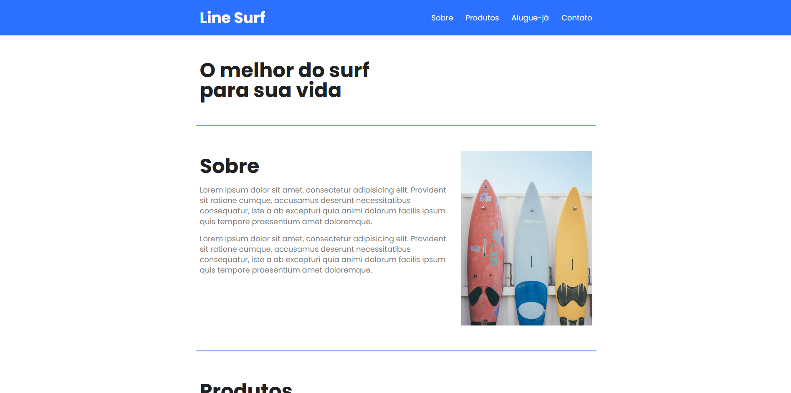

# 🌊 Life Surf



Life Surf é uma loja especializada no aluguel e venda de pranchas de surf, permitindo que você encontre o equipamento ideal para o seu estilo e nível de experiência. Caso se apaixone pela prancha que alugou, você pode adquiri-la e levá-la para casa. Além disso, oferecemos uma ampla variedade de acessórios para tornar sua experiência no surf ainda mais completa e inesquecível.

## 🌟 Sobre o Projeto

Life Surf é um site moderno e responsivo, criado para apaixonados pelo surf que desejam acompanhar produtos, preços e informações relevantes sobre o esporte. O design foi desenvolvido para garantir uma experiência fluida e envolvente em diferentes dispositivos, desde desktops até smartphones.

## 🎨 Tecnologias Utilizadas

- **HTML5** - Estrutura do site
- **CSS3** - Estilização e responsividade
- **Flexbox e Grid** - Layout dinâmico e responsivo
- **Variáveis CSS** - Paleta de cores customizável

## 📌 Funcionalidades

✔ Menu de navegação responsivo
✔ Seção de introdução com destaque para o conteúdo
✔ Seção "Sobre" para apresentar informações relevantes
✔ Cards de produtos e preços estilizados
✔ Formulário de contato funcional
✔ Rodapé elegante

## 📱 Responsividade

O site foi desenvolvido para se adaptar a diferentes resoluções de tela, garantindo uma boa usabilidade em dispositivos móveis.

## 🚀 Como Rodar o Projeto

1. Clone o repositório:
   ```bash
   git clone https://github.com/seu-usuario/life-surf.git
   ```
2. Navegue até a pasta do projeto:
   ```bash
   cd life-surf
   ```
3. Abra o arquivo `index.html` no navegador.

## ✨ Melhorias Futuras

🔹 Animações CSS para melhorar a interatividade
🔹 Implementação de um backend para gerenciar os dados
🔹 Melhorias na acessibilidade

## 📩 Contato

Se tiver alguma dúvida ou sugestão, entre em contato:
📧 Email: [Vinicius Jesus](vini.jesus1342@gmail.com)\
💼 LinkedIn: [Vinicius Jesus](https://www.linkedin.com/in/vin%C3%ADcius-jesus-5660a2232/)

---

Feito com ❤️ por [Vinícius Jesus]
